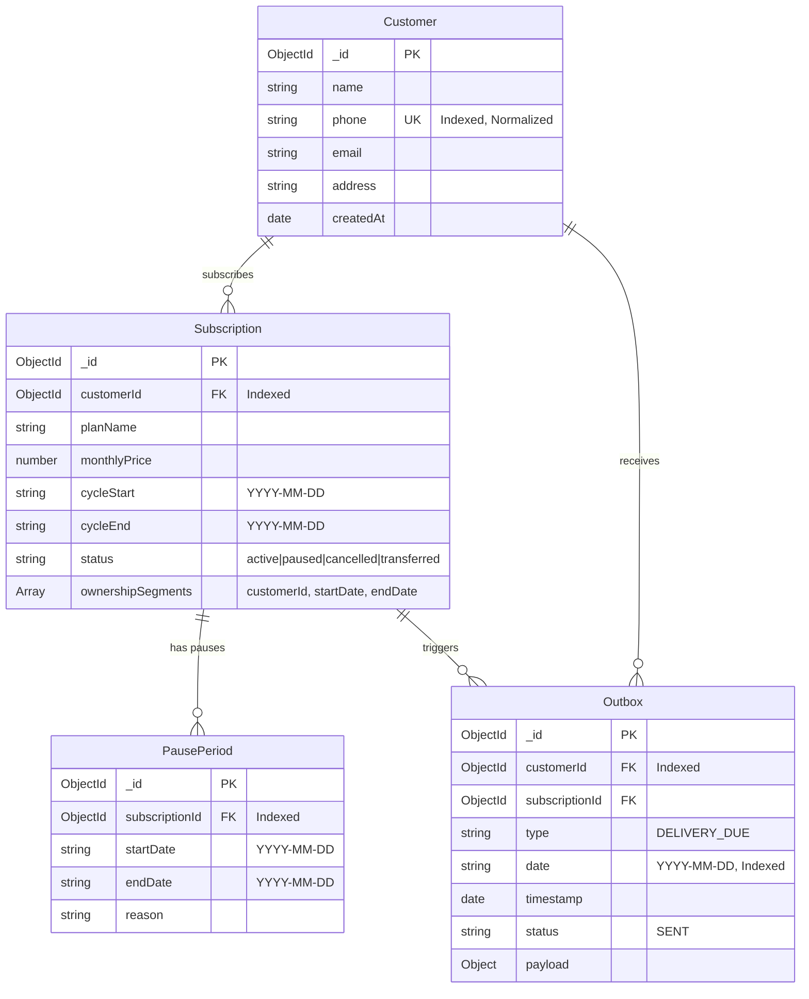

# TiffinTrack — Comprehensive Logic & Architectural Reasoning

This document provides a detailed breakdown of the mathematical models, business rules, data structures, algorithms, and architectural reasoning underlying **TiffinTrack**.

---

## 1. Core Billing Mathematical Model & Logic

### 1.1 The Fundamental Business Rule
Tiffin lunch delivery operates strictly on weekdays (Monday through Friday). Customers must only be charged for service days they were actually eligible to receive delivery. Weekends (Saturday and Sunday) are never billable, and customer-requested pause periods must be excluded from billing.

### 1.2 Mathematical Formulation
For any given subscription cycle:

$$\text{totalWeekdays} = \sum_{d \in [\text{cycleStart}, \text{cycleEnd}]} \mathbb{I}(\text{isWeekday}(d))$$

$$\text{pausedWeekdays} = \left| \bigcup_{P \in \text{pausePeriods}} \{ d \in [P.\text{start}, P.\text{end}] \cap [\text{cycleStart}, \text{cycleEnd}] \mid \text{isWeekday}(d) \} \right|$$

$$\text{servedWeekdays} = \max(0, \text{totalWeekdays} - \text{pausedWeekdays})$$

$$\text{amountDue} = \begin{cases} 
0 & \text{if } \text{totalWeekdays} = 0 \\
\text{round}_{2}\left( \text{monthlyPrice} \times \frac{\text{servedWeekdays}}{\text{totalWeekdays}} \right) & \text{if } \text{totalWeekdays} > 0 
\end{cases}$$

Where:
- $\mathbb{I}(\text{condition})$ is the indicator function (1 if true, 0 if false).
- $\text{round}_{2}(x) = \frac{\lfloor 100x + 0.5 \rfloor}{100}$ denotes standard rounding to two decimal places.

---

### 1.3 Step-by-Step Calculation Examples

#### Example 1: Standard Cycle without Pauses
- **Cycle**: Monday 2026-09-07 to Friday 2026-10-02 (4 weeks).
- **Monthly Price**: ₹2,000.00.
- **Total Weekdays**: 20 days.
- **Paused Weekdays**: 0 days.
- **Served Weekdays**: $20 - 0 = 20$ days.
- **Amount Due**:
  $$\text{amountDue} = 2000 \times \frac{20}{20} = ₹2,000.00$$

#### Example 2: Pauses with Weekend Spanning
- **Cycle**: Monday 2026-09-07 to Friday 2026-10-02 (20 weekdays).
- **Monthly Price**: ₹2,000.00.
- **Pause Period**: Friday 2026-09-18 to Tuesday 2026-09-22 (5 calendar days).
- **Weekday Analysis**:
  - Fri 2026-09-18: Weekday $\rightarrow$ Paused
  - Sat 2026-09-19: Weekend $\rightarrow$ Ignored
  - Sun 2026-09-20: Weekend $\rightarrow$ Ignored
  - Mon 2026-09-21: Weekday $\rightarrow$ Paused
  - Tue 2026-09-22: Weekday $\rightarrow$ Paused
- **Paused Weekdays**: Exactly 3 days.
- **Served Weekdays**: $20 - 3 = 17$ days.
- **Amount Due**:
  $$\text{amountDue} = 2000 \times \frac{17}{20} = ₹1,700.00$$

#### Example 3: Precision & Rounding
- **Cycle**: Tuesday 2026-09-01 to Tuesday 2026-09-29 (21 weekdays).
- **Monthly Price**: ₹2,500.00.
- **Paused Weekdays**: 8 weekdays.
- **Served Weekdays**: $21 - 8 = 13$ days.
- **Calculation**:
  $$\frac{2500 \times 13}{21} = \frac{32500}{21} \approx 1547.6190476...$$
- **Rounded**: Exactly **₹1,547.62**.

---

## 2. Pause Deduplication & Overlap Handling Logic

### 2.1 The Problem of Double-Counting
If a customer submits multiple pause intervals that overlap (e.g., Pause A: Sep 14–16 [Mon–Wed, 3 days] and Pause B: Sep 15–18 [Tue–Fri, 4 days]):
- A naive sum would produce $3 + 4 = 7$ paused days.
- However, September 15 and 16 are shared by both ranges. The true count of unique paused weekdays is only 5 days (Sep 14, 15, 16, 17, 18).

### 2.2 Algorithmic Resolution using Sets
In [`server/src/utils/billingCalculator.js`](file:///c:/Users/dell/Desktop/tiffin%20%20service/server/src/utils/billingCalculator.js):
```javascript
const pausedWeekdaysSet = new Set();
for (const pause of pausePeriods) {
  const pStart = pause.startDate > cycleStart ? pause.startDate : cycleStart;
  const pEnd = pause.endDate < cycleEnd ? pause.endDate : cycleEnd;
  if (pStart <= pEnd) {
    const weekdaysInPause = getWeekdaysInRange(pStart, pEnd);
    for (const day of weekdaysInPause) {
      pausedWeekdaysSet.add(day);
    }
  }
}
const pausedWeekdays = pausedWeekdaysSet.size;
```
By utilizing a mathematical `Set`, every weekday date string (`YYYY-MM-DD`) is unique. Overlapping pauses collapse naturally into single date entries, mathematically preventing double-discounting.

---

## 3. Date-Only Semantics (`YYYY-MM-DD`)

### 3.1 The Timezone & Daylight Saving Time (DST) Problem
Using native JavaScript `new Date("2026-09-17")` in local time or timezone-sensitive ISO strings creates drift:
- In UTC+5:30 (India Standard Time), `2026-09-17T00:00:00.000Z` corresponds to 5:30 AM local time.
- In UTC-8:00 (Pacific Time), it corresponds to 4:00 PM on September 16.
- This results in off-by-one weekday calculation bugs and inconsistent billing.

### 3.2 Pure Date-Only Representation
All dates are stored and compared strictly as 10-character ISO calendar strings (`YYYY-MM-DD`):
1. **Weekdays**: Evaluated via `Date.UTC(year, month - 1, day)` where `getUTCDay()` returns 1 (Monday) through 5 (Friday).
2. **Date Iteration**: Incremented using pure calendar addition:
   ```javascript
   export const addDays = (dateStr, days) => {
     const [year, month, day] = dateStr.split('-').map(Number);
     const d = new Date(Date.UTC(year, month - 1, day));
     d.setUTCDate(d.getUTCDate() + days);
     return `${d.getUTCFullYear()}-${String(d.getUTCMonth() + 1).padStart(2, '0')}-${String(d.getUTCDate()).padStart(2, '0')}`;
   };
   ```

---

## 4. Derived Customer Status Logic

### 4.1 Why Status Must Be Derived, Not Stored Statically
A customer's status (`active`, `paused`, `inactive`) is dynamic with respect to time:
- A customer scheduled to pause from September 20 to September 25 should appear `active` on September 17.
- On September 20, they must automatically appear `paused` without requiring a cron job to update database flags.
- When the cycle ends, they must appear `inactive`.

### 4.2 Dynamic Status Evaluation
Implemented in [`server/src/controllers/customerController.js`](file:///c:/Users/dell/Desktop/tiffin%20%20service/server/src/controllers/customerController.js):
```text
Given Customer C and Target Date D:
1. Find all subscriptions covering date D (cycleStart <= D <= cycleEnd).
2. If none exist -> Return "inactive".
3. For each active subscription:
   a. Check if Customer C is the active owner on date D (via ownershipSegments).
   b. If not owner on date D -> Continue.
   c. Check if date D falls inside any PausePeriod (startDate <= D <= endDate).
   d. If covered by pause -> Return "paused".
   e. If not covered by pause -> Return "active".
4. Default -> Return "inactive".
```

---

## 5. T6 Subscription Transfer Logic & Billing Split

### 5.1 Business Requirement
When a customer transfers their subscription mid-cycle:
1. The plan name, monthly price, and cycle dates remain unchanged.
2. The old customer is responsible only for weekdays served before the transfer date.
3. The new customer is responsible only for weekdays served from the transfer date onward.
4. Paused days within each window must be deducted from the respective owner.
5. Historical ownership must be preserved (not overwritten).

### 5.2 Ownership Segments Data Structure
In [`Subscription.js`](file:///c:/Users/dell/Desktop/tiffin%20%20service/server/src/models/Subscription.js):
```javascript
ownershipSegments: [
  {
    customerId: ObjectId,
    startDate: String, // YYYY-MM-DD
    endDate: String    // YYYY-MM-DD
  }
]
```

### 5.3 Transfer Slicing Algorithm
Upon `POST /api/subscriptions/:id/transfer` with `newCustomerId` and `transferDate`:
1. Validate `cycleStart <= transferDate <= cycleEnd`.
2. Locate the active segment currently covering the end of the cycle.
3. Set the active segment's `endDate = addDays(transferDate, -1)`.
4. Append a new segment:
   `{ customerId: newCustomerId, startDate: transferDate, endDate: cycleEnd }`.
5. Set `subscription.customerId = newCustomerId` (active owner).

### 5.4 Segmented Billing Calculation
In [`billingCalculator.js`](file:///c:/Users/dell/Desktop/tiffin%20%20service/server/src/utils/billingCalculator.js):
- Let $\mathcal{W}_{\text{served}}$ be the set of unpaused weekdays across the entire cycle.
- For each segment $S_i$:
  $$\text{served}_{S_i} = \sum_{d \in \mathcal{W}_{\text{served}}} \mathbb{I}(S_i.\text{start} \le d \le S_i.\text{end})$$
  $$\text{amountDue}_{S_i} = \text{round}_{2}\left( \text{monthlyPrice} \times \frac{\text{served}_{S_i}}{\text{totalWeekdays}} \right)$$

- **Guaranteed Consistency**:
  $$\sum_i \text{served}_{S_i} = \text{servedWeekdays}_{\text{total}}$$
  The sum of individual customer bills equals the total billable amount for the cycle.

---

## 6. T1 Morning Delivery Notification & Outbox Logic

### 6.1 Dispatch Architecture
1. **Clock Trigger (`POST /api/clock`)**:
   - Accepts a target `date` (defaults to today).
   - **Weekend Guard**: If `!isWeekday(date)`, returns immediately with `notifiedCount: 0`. No notifications are sent.
   - **Subscription Matching**: Retrieves subscriptions covering `date` with `status != 'cancelled'`.
   - **Pause Guard**: Excludes subscriptions where a `PausePeriod` spans `date`.
   - **Owner Resolution**: Evaluates `ownershipSegments` to identify the active owner on `date`.
2. **Service Abstraction**:
   - `notificationService.sendDeliveryNotification({ customer, subscription, date })` encapsulates the external gateway integration.
3. **Outbox Persistence**:
   - Each dispatched notification is logged into the `outboxes` collection:
     ```javascript
     await Outbox.create({
       customerId: customer._id,
       subscriptionId: sub._id,
       type: 'DELIVERY_DUE',
       date,
       timestamp: new Date(),
       status: 'SENT',
       payload: { ... }
     });
     ```
   - Audited via `GET /outbox` or `GET /api/outbox`.

---

## 7. T4 Messy Customer Import Logic

### 7.1 Sanitization Rules
1. **Phone Normalization** ([`phoneUtils.js`](file:///c:/Users/dell/Desktop/tiffin%20%20service/server/src/utils/phoneUtils.js)):
   - Strips whitespace, dashes, parentheses, dots, slashes: `str.replace(/[\s\-\(\)\.\/\\]/g, '')`.
   - Normalizes country codes (`+91` or `91` prefix on 10-digit numbers).
   - Normalizes trunk prefix (`0` on 11-digit numbers).
   - Requires 7 to 15 digits.
2. **Date Format Support** ([`dateUtils.js`](file:///c:/Users/dell/Desktop/tiffin%20%20service/server/src/utils/dateUtils.js)):
   - ISO: `YYYY-MM-DD`, `YYYY/MM/DD`.
   - Day-First: `DD-MM-YYYY`, `DD/MM/YYYY`.
   - Month-First: `MM-DD-YYYY`, `MM/DD/YYYY`.
   - Resolves ambiguity (if first part $> 12$, it is a day; otherwise defaults to Commonwealth/Indian day-first format).

### 7.2 Deterministic Deduplication Rules
- **Batch Cache**: Maintains a `batchPhoneMap` during the import loop.
- **Database Query**: Queries `Customer.findOne({ phone: normalizedPhone })`.
- **Action**:
  - If customer already exists: Row is counted as **`deduped`**. If new subscription details are present and non-duplicate, the subscription is attached to the existing customer without duplicating the customer record.
  - If customer does not exist: Customer and Subscription are created, counted as **`imported`**.
  - If validation fails (empty name, invalid phone, unparseable dates, non-positive price): Counted as **`rejected`**, with row index and exact error message logged to `errors`.

---

## 8. Database Schema & Indexing



---

## 9. Automated Testing Strategy (29 Criteria Covered)

The test suite runs with Node.js's native test runner (`node:test`) and covers all required criteria:

| Category | # | Test Description | File |
|---|---|---|---|
| **Customer** | 1 | Customer creation with normalized phone | `api.test.js` |
| | 2 | Phone normalization across diverse formats | `phoneUtils.test.js` |
| | 3 | Duplicate phone rejection (409 Conflict) | `api.test.js` |
| | 16 | Phone lookup via `GET /api/customers/:phone` | `api.test.js` |
| **Subscription** | 4 | Subscription creation with initial segment | `api.test.js` |
| | 14 | Customer active status derivation | `api.test.js` |
| | 15 | Customer paused status derivation | `api.test.js` |
| **Date & Weekday** | 5 | Weekday calculation (Mon–Fri) | `dateUtils.test.js` |
| | 6 | Weekend exclusion (Sat & Sun skipped) | `dateUtils.test.js` |
| | 10 | Pause spanning a weekend | `dateUtils.test.js` |
| **Billing** | 7 | Zero pause billing (full amount) | `billingCalculator.test.js` |
| | 8 | 1 paused weekday deduction | `billingCalculator.test.js` |
| | 9 | Multiple paused weekdays deduction | `billingCalculator.test.js` |
| | 10 | Weekend-spanning pause deduction | `billingCalculator.test.js` |
| | 11 | Overlapping pause overlap handling (no double-discount) | `billingCalculator.test.js` |
| | 12 | Full-cycle pause billing (zero amount) | `billingCalculator.test.js` |
| | 13 | Consistent 2-decimal rounding | `billingCalculator.test.js` |
| **T1 Clock** | 17 | `/clock` excludes weekends | `t1_clock_outbox.test.js` |
| | 18 | `/clock` excludes paused customers | `t1_clock_outbox.test.js` |
| | 19 | `/clock` includes active customers | `t1_clock_outbox.test.js` |
| | 20 | `/outbox` contains generated notifications | `t1_clock_outbox.test.js` |
| **T6 Transfer** | 21 | Transfer preserves plan | `t6_transfer.test.js` |
| | 22 | Transfer preserves cycle dates | `t6_transfer.test.js` |
| | 23 | Old/new customer billing split | `t6_transfer.test.js` |
| | 24 | Transfer with paused days attribution | `t6_transfer.test.js` |
| **T4 Import** | 25 | Duplicate phone handling (deduped count) | `t4_import.test.js` |
| | 26 | Mixed date formats parsing | `t4_import.test.js` |
| | 27 | Blank required fields handling | `t4_import.test.js` |
| | 28 | Invalid rows rejection with error reason | `t4_import.test.js` |
| | 29 | Correct `{ imported, deduped, rejected, errors }` report | `t4_import.test.js` |
